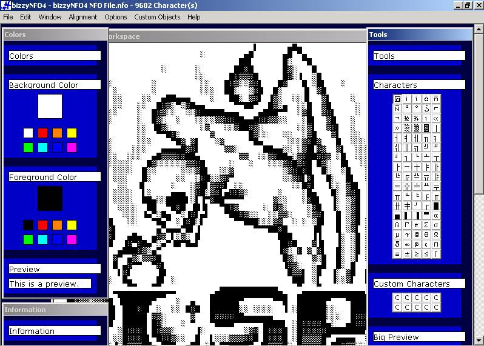



## BizzyNFO4 \* NFO \\ DIZ Viewer \\ Creator \* \!\!

### Description

This program creates and view's NFO and DIZ files. This is the newest version of the program. New features include 80+ tools to make your NFO or DIZ file, it also has 10 customizable tools. bizzyNFO4 also lets you use multiple tools at once. 7 to be exact. There are also many many more features, many. Give this program a try. Also if you used it please rate it if you can. That will be greatly appreciated. Also please leave me some comments, to keep in mind when I create the next version.
 
### More Info
 

             |
---                |---
**Submitted On**   |2002-06-17 12:01:48
**By**             |[Malcolm T](https://github.com/Planet-Source-Code/PSCIndex/blob/master/ByAuthor/malcolm-t.md)
**Level**          |Advanced
**User Rating**    |5.0 (50 globes from 10 users)
**Compatibility**  |VB 5\.0, VB 6\.0
**Category**       |[String Manipulation](https://github.com/Planet-Source-Code/PSCIndex/blob/master/ByCategory/string-manipulation__1-5.md)
**World**          |[Visual Basic](https://github.com/Planet-Source-Code/PSCIndex/blob/master/ByWorld/visual-basic.md)
**Archive File**   |[BizzyNFO4\_954706172002\.zip](https://github.com/Planet-Source-Code/malcolm-t-bizzynfo4-nfo-diz-viewer-creator__1-35958/archive/master.zip)

